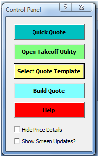

# Quote-Takeoff-Automation
This repository contains an automated takeoff and quote package for concrete construction projects.

Quote-Takeoff Utility User’s Guide
The Quote-Takeoff Utility, QT, is a proprietary, Office Automation Application built for Marshall Construction. The standard Microsoft Office applications, Word and Excel are used with Visual Basic (VB) programming behind the documents. Basically, the QT application copies Shawn’s Takeoff and Jinelle’s Quote templates to pastes them into the corresponding parts of QT. The VB code then edits the copies to build a Quote. Neither Shawn’s nor Jinelle’s documents are change in any way nor are calculations done. All numbers are as Shawn calculated them.
Finished Quotes from the Estimating 2012 folder guide the wording produced by QT3. Sometimes the templates and the real-life quotes are different. In those cases, the actual quotes guide the wording.
The steps to building a Quote are not set in concrete; the order can be varied. For example, the TakeoffUtility can be opened directly without opening the QuoteUtility first. If this is done, then start at Step 3, as described in this guide. Steps 3-14 are all done in the TakeoffUtility. If a Takeoff is already loaded in the utility, then the Quote can be built immediately. Just click-on Build Quote and you are done. 
The guiding principle in this latest version of QT3 is to keep it simple. The following is a Quick Reference Guide to QT3.
Summary of Steps:
1.	Quick Quote
2.	Open QuoteUtility
3.	View QuoteUtility Control Panel
4.	Click-on Open TakeoffUtility, 
5.	Wait for TakeoffUtility.xlsm
6.	Show TakeoffUtility Control Panel
7.	Open Select Takeoff Dialog Box
8.	Select Takeoff
9.	Confirm Default Values
10.	Confirm the Client Info
11.	Close the TakeoffUtility
12.	Confirm Quote Template
13.	Build Quote
14.	Quote Sections
15.	Trust Center Setup
16.	Customize Quick Access Toolbar
 
1.	Quick Quote
Quick Quote takes the next step in automation. With Quick Quote (1), the application opens Excel; then from Word runs the Excel, “Select Takeoff”, procedure. After the Takeoff is chosen, it is automatically copied to the TakeoffUtility. The type of takeoff is determined by matching key phrases; then the appropriate Quote Template is copied based on the matches. Finally, the Quote is built. All of these procedures are run automatically, with the only user input being to select the Takeoff.

This series of procedures runs smoothly, as long as, the client information is in the Timberline database and the default OPI and Extras are acceptable. If the client is not found (2), the “Input Client Information” form opens (3); then the process flow continues without further user input.  
“Quick Quote” is the easiest way to build a quote when the default items are acceptable. However, the “Build Quote” procedure has more flexibility, allowing the OPI and Extras to be edited manually in the Excel, Takeoff before building the Word, Quote. Ironically, when the Takeoff is already setup in the TakeoffUtility, the “Build Quote” procedure requires less process and is much faster than the “Quick Quote” procedure.
1.	Open Quote Utility:
The quote building process generally starts with the QuoteUtility. The QuoteUtility is a Word Document with Visual Basic code behind the pages (.docm). The QuoteUtility is found in the Estimating directory, QT folder. The functionality of the utility is accessed through the Control Panel. 

2.	View QuoteUtility Control Panel:
The Control Panel is viewed three ways.
•	Click-on the green icon (1) near the top of the window. 
•	Press ctrl+p
•	Right click-on the main window. A context menu (2) will appear; this menu varies with the “context” of the area that is clicked on. In areas free of other special context items; the top item is Quote Control Panel, click-on the menu item, and then click-on Show Control Panel.

3.	Click-on the 2nd button (green), Open TakeoffUtility: 
There are Control Panels for the two main parts of QT: QuoteUtility and TakeoffUtility. The QuoteUtility, Control Panel has five buttons. Buttons 2-5 are used together, but top button is used alone to build a quote with default values. This could be a good first draft.  

4.	Wait ~12 seconds for Excel to open:    

Note: the QuoteUtility, Visual Basic programming, can get confused when other Word document are open while the QuoteUtility is processing. The safest procedure is to close other Word documents. 
Most problems occur while opening Excel from Word. When QT hangs, close Excel. It might not be visible; check the Task Manager to see if there is an open Excel process causing the problem. The Windows Task Manager is opened by right clicking on the Taskbar at the bottom of the screen (1). 

On the Process Tab (2) of the Task Manger, right click-on EXCEL.EXE in the Task list (3); then click-on End Process (4) in the popup window.

5.	Show the Takeoff Control Panel:
The Control Panel is viewed similar to the QuoteUtility Control Panel; there are three ways to show it:
•	Click-on the green icon (4) near the top of the window. 
•	Press ctrl+p
•	Right click-on any cell. A context menu will appear  (5). The top item is Takeoff Utility, put your mouse cursor over the menu item, and then click-on Show Control Panel.

6.	Open Select Takeoff Dialog Box:
There are several buttons on the TakeoffUtility, Control Panel, but normally, only the top one is used (the other buttons are explained later). Click-on the top button, Get Takeoff button (tan), to open the Select Takeoff Dialog Box. 
7.	Select Takeoff:
The “Select Takeoff” Button opens the Select Takeoff Dialog Box (2). This window might hide behind the Takeoff window.

If the Select Takeoff popup does not appear, check behind the Takeoff window. The open windows are viewed by pressing alt+tab repeatedly. 

After a Takeoff is selected, it is copied to the TakeoffUtility, OriginalTakeoff sheet. This takes a minute.	

8.	Confirm Default Values:
After the copy is made, the utility transfers items from the OriginalTakeoff sheet to the UpdatedTakeoff sheet. This process will write over any existing information on the Updated sheet. A Warning popup will appear asking you to confirm this action, choose yes. 

9.	Confirm Client Info:
Generally, this is the last step before running the Build Quote process. However, before closing the TakeoffUtility, confirm that the client information is properly set on the ClientInfo sheet. Click the yellow button (1) near the top middle of the UpdatedTakeoff sheet, or click-on the Control Panel, Client Information button (green, 2).

On the Client sheet, review the information in the top, left gray range (3) for the correct client name and address. If these are correct, then close the TakeoffUtility to go back to the QuoteUtility. The TakeoffUtility must be closed to avoid opening multiple instances when the Quote Build process runs.

 

If the ClientInfo is wrong there are several options available to correct it. 
a.	In Cell A13 (4), type the first 3-5 letters of the client name. 
b.	Then press the <enter> key (it is easy skip this step, don’t forget), 
c.	Finally press the green, Find Client button (5). 
i.	This searches a copy of the Timberline customer database. All matches are returned to Column D, beginning in row 14.
ii.	This also searches the QuotedClients sheet for matches. The QuotedClients are previous clients that were entered using the Update Client Info button (blue, 6).

If no matches are found on either the Timberline or QuotedClients sheets, then the “Input Client Information” form pops up. 
a.	This will enter (1) a new row on the QuotedClients sheet. 
b.	If you do not want to use this form, then close the form by clicking on the X in the top, right corner (2).

10.	Close the TakeoffUtility: 
The client name must be entered before closing the TakeoffUtility. A warning message will popup when Cell(“A2”) is empty. After confirming that the ClientInfo is correct, including the “Regards:”, close the TakeoffUtility to run the Build Quote process.

Note: There is much more functionality built into the Takeoff. This functionality includes several item management forms that are accessed from the Control Panel, more about that later.

The QuoteUtility was left open when the TakeoffUtility was opened. After closing the TakeoffUtility the QuoteUtility is still there. 
11.	Confirm Quote Template:
Check to see if the correct Quote Template is loaded. 

a.	The standard templates are: non-walkout, walkout, Abbey, and Eagle/Pegasus quotes. 
b.	If a different template is needed, on the Control Panel click-on the “Select Quote Template” button (yellow). If the Control Panel is not showing press ctrl+p or the green icon as before.

The procedure for copying a Quote template is the same as copying a Takeoff. 
c.	The Select Quote Template window pops-up. 
d.	Choose the template needed by double clicking on it.
12.	Build Quote:
Everything is set to run the Build Quote, click Build Quote button (blue). This process opens Excel again, but does not show it. However, it requires a minute to transfer all the data from the TakeoffUtility to the QuoteUtility.

You are done with the basic build process. 

13.	Quote Sections:
The standard quote contains 5 sections: Client Info, Measurements, Our Price Includes, Our Price, and Extras. However, there are variations from this standard as seen on Abbey and Eagle/Pegasus style quotes.
ClientInfo Section. 
The client contact information contained in the ClientInfo Section of the quote is stored in the Timberline AR database, for existing client. The TakeoffUtility automatically retrieves this information when it is available. There are two pieces of information in the ClientInfo section that are not in the database: Track # and Regards. These two pieces are parsed from the file name and header of the Takeoff. The “sq.ft.” is usually not on the Takeoff, so this must be added manually. The yellow/tan areas on the Client worksheet can be typed into.
Measurements Section.
Measurements and counts of walls, corners etc. are shown in this section. The format is generally the number followed by a brief description. This section is called Labour for Abbey and Eagle/Pegasus style quotes. The layout is generally followed with little need for changes; however, these items can be edited in the TakeoffUtility, on the Manage Measurements Form, when necessary. (Eagle/Pegasus quotes contain divisions between the ClientInfo and Measurements Sections. These will be described later.)
Our Price Includes Section.
The items in this section depend on the type of job: walkout or non-walkout, hence they often require edits. The programming catches most of these edits, but there are times when the wording is too complex for the program to handle. For example the Mudsill materials, the combination of standard and treated with the various sizes of lumber is complicated. The program attempts to provide the proper dimensions, but this will usually need tweaking.
Our Price Section.
This section is simple. The only changes that might be needed are in the spacing of empty lines, before and after the section.
Extras Section.
The Extras vary a lot in number of items and in number of subsections. These items are sometimes present in the Our Price Includes Section. Of course, the same items should not be in both sections. Extras must be selected manually in the TakeoffUtility. The “Manage Extras Form” has a tab for each subsection of Extras. The standard Extras are listed on the form. These items can be added, deleted or edited as needed.

(The TakeoffUtility, UpdatedTakeoff worksheet contains ranges of cells and management forms corresponding to each of the quote sections, as well as, additional ranges to handle variations from the standard quotes as seen with Abbey and Eagle/Pegasus quotes.)
Abbey and Eagle/Pegasus Quotes.
These quotes are arranged differently than the standard quotes. The items are divided into divisions, rather than sections. However, the individual items are very similar, if not identical, to those found on the standard quote. Consequently, most of the differences are in how the items are organized. 
Abbey Labour Division.
The Labour Division is equivalent to the Measurements Section.
Eagle/Pegasus Quotes.
These quotes contain additional divisions between the Client Info Section and the Labour Division. The Excavation, Backfill and Spread data are often presented here. The Manage Pegasus Form in the TakeoffUtility is present for these divisions. In addition, this form contains a tab for “New Division”. This allows the addition of a new division on-the-fly. It is inserted on the quote immediately above the Labour Division.

 
14.	Trust Center Setup:
The Security features of Office 2007 applications are setup using the Trust Center. When a document with macros is opened a Security Warning can show in the Message Bar (1) just below the Command Ribbon. Clicking on the Options button (2) causes the Office Security Options window (3) to popup. Macros are enabled one-time by selecting the radio button for “Enable this content” (4), or the macros can be enabled permanently by clicking on the hyperlink at the bottom of the popup, “Open the Trust Center” (5). This link opens the same window as clinking to the Office Button in the upper, right corner of the Word Window; then click-on “Word Options”, at the bottom of the popup (6).
Summary of Trust Center Settings:
•	Click-on Security Warning, Options or Office Button
•	Word Options 
•	Open Trust Center
o	Trust Center Settings
•	Trusted Locations
o	Check “Allow trusted locations…”
o	Add New Location
•	Trusted Location Dialog Box
o	Check “Subfolders…”
o	Browse
•	Browse Dialog Box
o	Select the QT folder
o	OK, OK, OK

The Word Options popup contains several tabs, for Security issues, click-on Trust Center (1), then Trust Center Settings (2). 

On the Trust Center popup, click-on Trusted Locations (3).

Near the bottom of the window check “Allow Trusted Locations on my network” (4), then click-on “Add new location…”  (5).  

On the “Microsoft Office Trusted Location” dialog box check the “Subfolders of this location are also trusted” (1) and click to Browse for the folder to add as trusted (2).

In the Browse dialog box (3) select the QT folder (4), and click OK, OK, OK in all windows.

15.	Customize Quick Access Tool Bar

The round, green icon (1) in the Quick Access bar at the top of the Word window is a custom button, setup using the Word Options dialog box (2). The Customize tab (3) contains a drop down list, select Macros(4), then select the “QuoteProject.opencloseModule.showControlPanel” macro in the left list (5), then click Add (6) to move it to the right-list (7). Click on the Show Control Panel macro to select it then click on the Modify button (8) near the bottom of the dialog box. This will pop-up another window to choose an icon for the macro. After selecting a macro click-on OK.
 
The steps to setup the “Quick Access Bar” are the same in Excel. 
